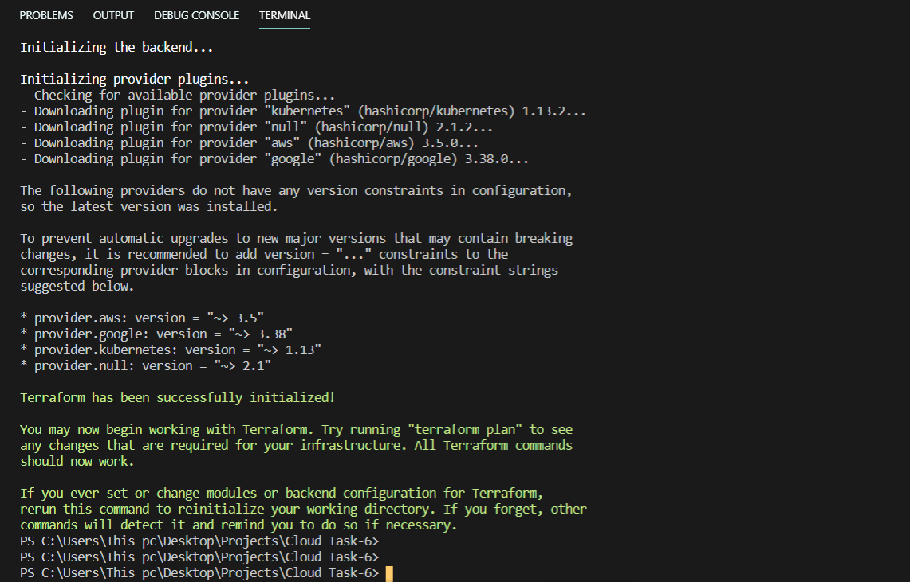
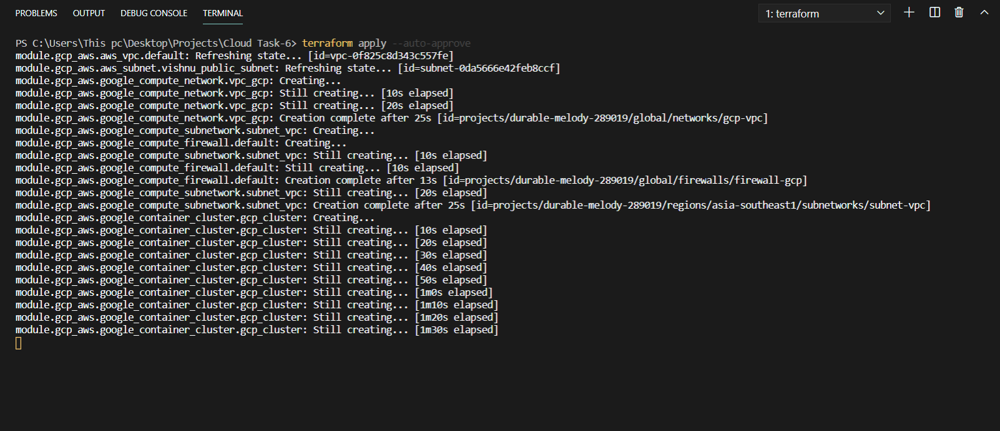
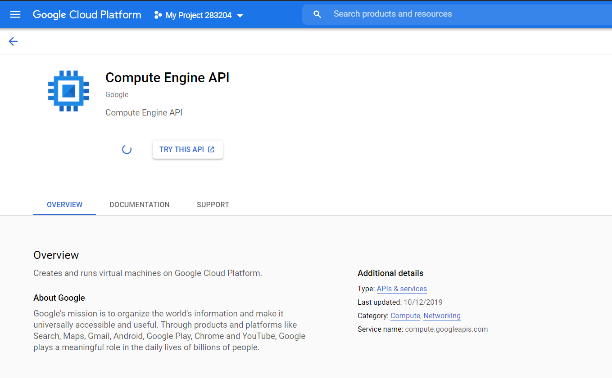
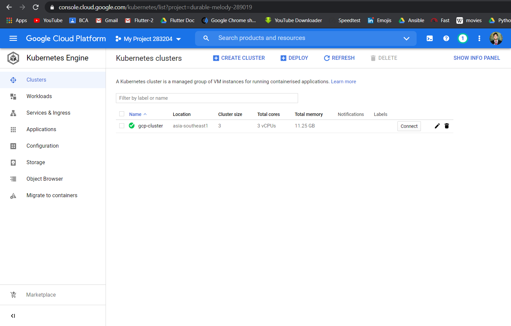
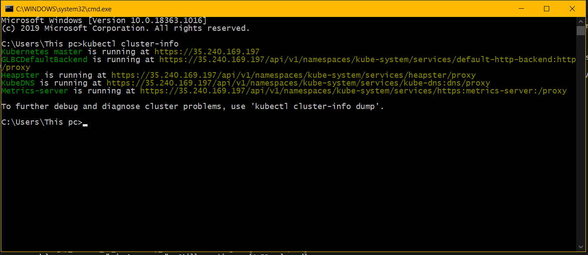
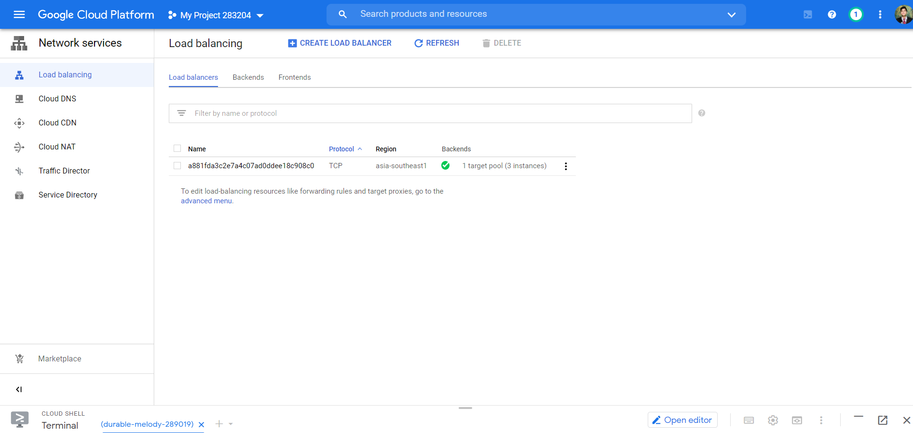
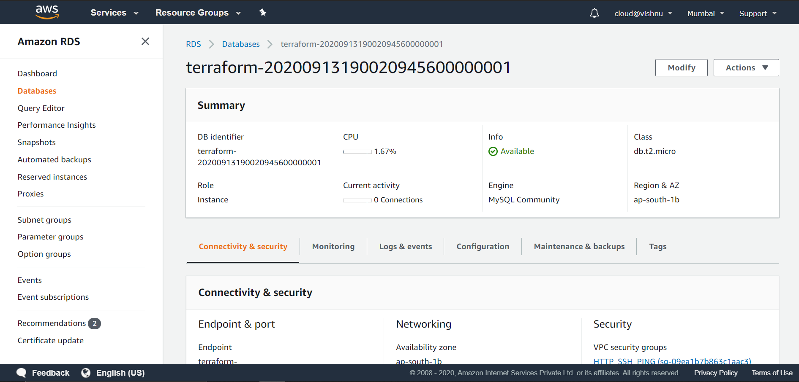
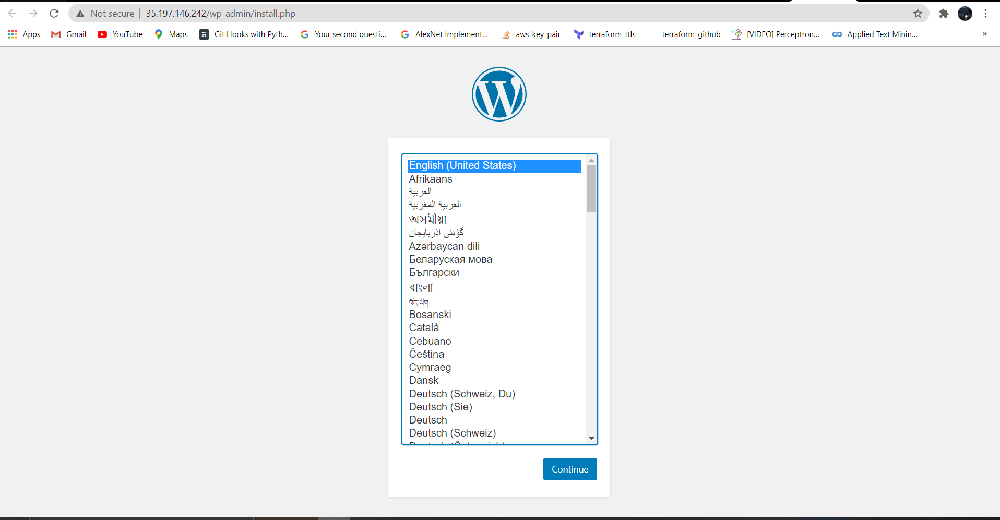
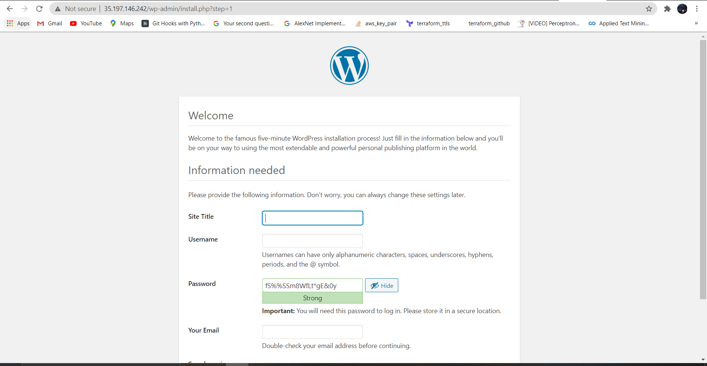
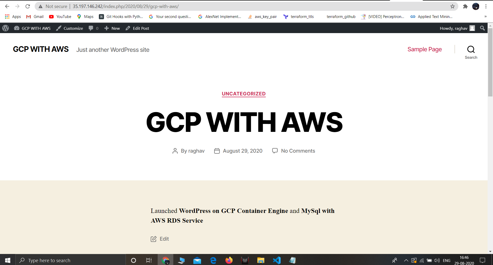

# Wordpress-on-K8s-Using-GCP

# **Description:-**

_🔷I deployed the WordPress application on Kubernetes and AWS using terraform including the following steps:- 🔷_

_✅ I wrote an infrastructure as code using Terraform which automatically deploys the WordPress application._

_✅ On AWS, I used RDS service for the relational database for the WordPress application._

_✅ Then, deployed WordPress as a container either on top of Minikube or EKS or Fargate service on AWS._

_✅ The WordPress application is accessible from the public world which deployed on AWS._

_**I have used the GKE service for installing Wordpress on Kubernetes. I have used the concept of modules in Terraform for writing code in a more efficient and managed way.**_

# Prerequisites for making this task:-

_1. GCP Account._

_2. AWS Account._

_3. Terraform._

_4. Kubectl command installed._

_5. AWS CLI._

_6. Gcloud SDK installed._

_7. AWS IAM User._

_8. GCP credentials._

_9. Text Editor._

**Now, I am showing first the main and variables files of _Terraform_**

_In this file, we have modules and provider for GCP and AWS too._

 **main.tf**

                      provider "google" {
                        credentials = file("${var.gcp_credentials_path}")
                        project     = var.gcp_project_id
                        region      = var.gcp_cur_region
                      }

                      provider "aws" {
                      profile   = var.aws_profile
                        region  = var.aws_region
                      }

                      module "gcp_aws"{

                       source = "./modules"

                      gcp_project_id=var.gcp_project_id
                      gcp_vpc_name=var.gcp_vpc_name
                      subnet_gcp_name=var.subnet_gcp_name
                      subnet_ip_cidr_range=var.subnet_ip_cidr_range
                      gcp_subnet_region=var.gcp_subnet_region
                      gcp_compute_firewall=var.gcp_compute_firewall
                      allowed_ports=var.allowed_ports

                      google_container_cluster_name=var.google_container_cluster_name
                      google_container_cluster_location=var.google_container_cluster_location
                      gcp_node_config_machine_type=var.gcp_node_config_machine_type

                      aws_db_instance_storage_type=var.aws_db_instance_storage_type
                      aws_db_instance_engine=var.aws_db_instance_engine
                      aws_db_instance_engine_version=var.aws_db_instance_engine_version
                      aws_db_instance_instance_class=var.aws_db_instance_instance_class
                      aws_db_instance_db_name=var.aws_db_instance_db_name
                      aws_db_instance_username=var.aws_db_instance_username
                      aws_db_instance_password=var.aws_db_instance_password
                      aws_db_instance_publicly_accessible=var.aws_db_instance_publicly_accessible
                      aws_db_instance_skip_final_snapshot=var.aws_db_instance_skip_final_snapshot

                      }

**vars.tf**

                      variable "gcp_credentials_path"{

                          default="C:\\Users\\This pc\\AppData\\Roaming\\gcloud\\application_default_credentials.json"
                      }

                      variable "gcp_project_id"{

                           default="durable-melody-289019"
                      }

                      variable "gcp_cur_region"{

                            default="asia-south1"
                      }

                      variable "aws_profile"{

                          default="GCP_user"
                      }

                      variable "aws_region"{

                         default= "ap-south-1"
                      }

                      variable "gcp_vpc_name"{

                          default = "gcp-vpc"

                      }

                      variable "subnet_gcp_name"{
                          default = "subnet-vpc"
                      }

                      variable "subnet_ip_cidr_range"{
                          default = "10.0.2.0/24"
                      }

                      variable "gcp_subnet_region"{
                          default = "asia-southeast1"
                      }

                      variable "gcp_compute_firewall"{
                          default = "firewall-gcp"
                      }

                      variable "allowed_ports"{

                          type=list
                          default=["80","22"]

                      }

                      variable "google_container_cluster_name"{

                          default="gcp-cluster"
                      }

                      variable "google_container_cluster_location"{
                          default = "asia-southeast1"
                      }

                      variable "gcp_node_config_machine_type"{
                          default = "n1-standard-1"
                      }

                      variable "aws_db_instance_storage_type"{
                          default = "gp2"
                      }

                      variable "aws_db_instance_engine"{
                      default = "mysql"
                      }

                      variable "aws_db_instance_engine_version"{
                      default = 5.7
                      }

                      variable "aws_db_instance_instance_class"{
                      default = "db.t2.micro"
                      }

                      variable "aws_db_instance_db_name"{
                      default = "db"
                      }

                      variable "aws_db_instance_username"{
                      default = "admin"
                      }

                      variable "aws_db_instance_password"{
                      default = "thevishnuhimself"
                      }

                      variable "aws_db_instance_publicly_accessible"{
                      default = true
                      }

                      variable "aws_db_instance_skip_final_snapshot"{
                      default = true
                      }

**Now, the modules folder where the code of each service is present in the form of Terraform.**

_**gcp_vpc.tf**_

                      variable "gcp_vpc_name"{}

                      variable "subnet_gcp_name"{}
                      variable "subnet_ip_cidr_range"{}

                      variable "gcp_subnet_region"{}

                      variable "gcp_compute_firewall"{}

                      variable "allowed_ports"{}

                      variable "gcp_project_id"{}

                      // Creating a VPC
                      resource "google_compute_network" "vpc_gcp" {
                       name =  var.gcp_vpc_name
                       auto_create_subnetworks=false
                        project= var.gcp_project_id
                      }
                      // Creating a subnetwork
                      resource "google_compute_subnetwork" "subnet_vpc" {
                          depends_on=[google_compute_network.vpc_gcp]
                          name          =var.subnet_gcp_name
                       ip_cidr_range = var.subnet_ip_cidr_range
                       region        =var.gcp_subnet_region
                       network       = google_compute_network.vpc_gcp.id
                      }
                      // Creating a firewall
                      resource "google_compute_firewall" "default" {
                      depends_on=[google_compute_network.vpc_gcp]
                       name    =var.gcp_compute_firewall
                       network = google_compute_network.vpc_gcp.name
                       allow {
                              protocol = "icmp"
                       }
                       allow {
                              protocol = "tcp"
                              ports    = var.allowed_ports
                       }
                      }

_**gcp_gke.tf**_

                      variable "google_container_cluster_name"{}

                      variable "google_container_cluster_location"{}

                      variable "gcp_node_config_machine_type"{}

                      resource "google_container_cluster" "gcp_cluster" {
                      depends_on=[google_compute_network.vpc_gcp]
                       name               = var.google_container_cluster_name
                       location           = var.google_container_cluster_location
                       initial_node_count = 1
                       master_auth {
                              username = ""
                              password = ""
                              client_certificate_config {
                                  issue_client_certificate = false
                              }
                          }
                          node_config {
                              machine_type= "n1-standard-1"
                          }
                          network= google_compute_network.vpc_gcp.name
                          project=var.gcp_project_id
                          subnetwork=google_compute_subnetwork.subnet_vpc.name
                      }
                      // running the command to update the kubeconfig file
                      resource "null_resource" "cluster" {
                      provisioner "local-exec" {
                       command ="gcloud container clusters get-credentials ${google_container_cluster.gcp_cluster.name}  --region ${google_container_cluster.gcp_cluster.location} --project ${google_container_cluster.gcp_cluster.project}"
                       }
                      }
                      
                      
 _**K8s_Cluster.tf**_           

                      provider "kubernetes" {
                          config_context_cluster="gke_${google_container_cluster.gcp_cluster.project}_${google_container_cluster.gcp_cluster.location}_${google_container_cluster.gcp_cluster.name}"
                      }
                      resource "kubernetes_service" "k8s" {
                          depends_on=[aws_db_instance.wp_db,google_container_cluster.gcp_cluster]
                          metadata{
                              name="wp"
                              labels={
                                  env="test"
                                  name="wp"
                              }
                          }
                          spec{
                              type="LoadBalancer"
                              selector={
                              app="wp"
                              }
                              port{
                                  port=80
                                  target_port=80
                              }
                          }
                      }
                      output "ip_add"{
                          value=kubernetes_service.k8s.load_balancer_ingress[0].ip
                      }
                      resource "kubernetes_deployment" "wp_deploy"{
                          depends_on=[aws_db_instance.wp_db,google_container_cluster.gcp_cluster]
                          metadata{
                              name="wp-deploy"
                              labels={
                                  name="wp-deploy"
                                  app="wp"
                              }
                          }
                          spec{
                              replicas=1
                              selector{
                                  match_labels = {
                                      app="wp"
                                  }
                              }
                              template{
                                  metadata{
                                      name="wp-deploy"
                                      labels={
                                          app="wp"
                                      }
                                  }
                                  spec{
                                      container{
                                          name="wp"
                                          image="wordpress"
                                          env{
                                              name="WORDPRESS_DB_HOST"
                                              value=aws_db_instance.wp_db.address
                                          }
                                          env{
                                              name="WORDPRESS_DB_USER"
                                              value=aws_db_instance.wp_db.username
                                          }
                                          env{
                                              name="WORDPRESS_DB_PASSWORD"
                                              value=aws_db_instance.wp_db.password
                                          }
                                          env{
                                              name="WORDPRESS_DB_NAME"
                                              value=aws_db_instance.wp_db.name
                                          } 
                                      }
                                  }
                              }
                          }
                      }
                      // open wordpress site on browser
                      resource "null_resource" "open_wordpress" {
                      provisioner "local-exec" {
                      command ="start chrome ${kubernetes_service.k8s.load_balancer_ingress[0].ip}"
                          }
                      }

_**aws_rds.tf**_

                      variable "aws_db_instance_storage_type"{}

                      variable "aws_db_instance_engine"{}

                      variable "aws_db_instance_engine_version"{}

                      variable "aws_db_instance_instance_class"{}

                      variable "aws_db_instance_db_name"{}

                      variable "aws_db_instance_username"{}

                      variable "aws_db_instance_password"{}

                      variable "aws_db_instance_publicly_accessible"{}

                      variable "aws_db_instance_skip_final_snapshot"{}

                      resource "aws_vpc" "defaultvpc" {
                                  cidr_block = "192.168.0.0/16"
                                  instance_tenancy = "default"
                                  enable_dns_hostnames = true
                                  tags = {
                                    Name = "vishnu_vpc"
                                  }
                                }

                      resource "aws_subnet" "vishnu_public_subnet" {
                                  vpc_id = aws_vpc.defaultvpc.id
                                  cidr_block = "192.168.0.0/24"
                                  availability_zone = "ap-south-1a"
                                  map_public_ip_on_launch = "true"
                                  tags = {
                                    Name = "vishnu_public_subnet"
                                  }
                                }

                      resource "aws_subnet" "vishnu_public_subnet2" {
                                  vpc_id = aws_vpc.defaultvpc.id
                                  cidr_block = "192.168.1.0/24"
                                  availability_zone = "ap-south-1b"
                                  map_public_ip_on_launch = "true"
                                  tags = {
                                    Name = "vishnu_public_subnet2"
                                  }
                                }

                      resource "aws_db_subnet_group" "default" {
                        name       = "main"
                        subnet_ids = [aws_subnet.vishnu_public_subnet.id,aws_subnet.vishnu_public_subnet2.id]

                        tags = {
                          Name = "My DB subnet group"
                        }
                      }

                      resource "aws_internet_gateway" "vishnu_gw" {
                                  vpc_id = aws_vpc.defaultvpc.id
                                  tags = {
                                    Name = "vishnu_gw"
                                  }
                                }

                      resource "aws_security_group" "vishnu_public_sg" {
                                  depends_on=[google_container_cluster.gcp_cluster]
                                  name        = "HTTP_SSH_PING"
                                  description = "It allows HTTP SSH PING inbound traffic"
                                  vpc_id      = aws_vpc.defaultvpc.id

                       ingress {
                          description = "TLS from VPC"
                          from_port   = 0
                          to_port     = 0
                          protocol    = "-1"
                          cidr_blocks = ["0.0.0.0/0"]
                          ipv6_cidr_blocks = ["::/0"]
                        }

                        egress {
                          from_port   = 0
                          to_port     = 0
                          protocol    = "-1"
                          cidr_blocks = ["0.0.0.0/0"]
                          ipv6_cidr_blocks = ["::/0"]
                        }

                                    tags = {
                                    Name = "HTTP_SSH_PING"
                                  }
                                }

                      resource "aws_db_instance" "wp_db" {
                          depends_on=[aws_security_group.vishnu_public_sg]
                              allocated_storage    = 20
                              storage_type         = var.aws_db_instance_storage_type
                              engine               = var.aws_db_instance_engine
                              engine_version       = var.aws_db_instance_engine_version
                              instance_class       = var.aws_db_instance_instance_class
                              name                 = var.aws_db_instance_db_name
                              username             = var.aws_db_instance_username
                              password             = var.aws_db_instance_password
                              parameter_group_name = "default.mysql5.7"
                              publicly_accessible  = var.aws_db_instance_publicly_accessible
                              skip_final_snapshot  = var.aws_db_instance_skip_final_snapshot
                              vpc_security_group_ids = [aws_security_group.vishnu_public_sg.id]
                              db_subnet_group_name = aws_db_subnet_group.default.name
                       }

 _**Now, initialize the Terrafrom code by running `terrafrom init` command.**_
 
 
 
 
 

_**Then, for the execution of the code, run the `terraform apply` command**_

_**Now, after running the command apply we have to enable the Compute Engine API in GCP**_

_**The cluster in GCP**_

_**Finally, to check the Cluster info we have to check the kubectl in command shell by running `kubectl cluster-info`**_

_You can see in this image that **Kubernetes master is running**_

_**Now, to check the nodes that whether they successfully created or not, we have to run `kubectl get nodes -o wide` in the command shell**_

_**Load Balancing**_

_**The Database in AWS**_

_**Kudos, our wordpress is launched now**_

_**Here, I made a webpage with the help of wordpress**_

# Thanks for your time to read
_**Always welcome your feedback.....**_
